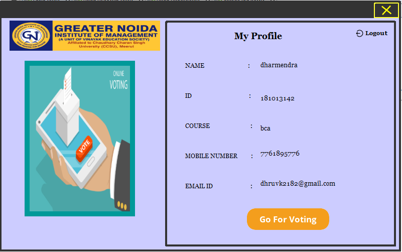

<h2>OnlineVotingSystem_For_Collages<h2>
This Project is Developed using Java Language
If you want to run this Window Application first download Netbean and any other database application
 
  
   
  
   
  
   
  
   
  
   
 
